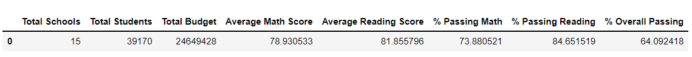
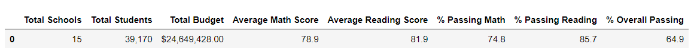
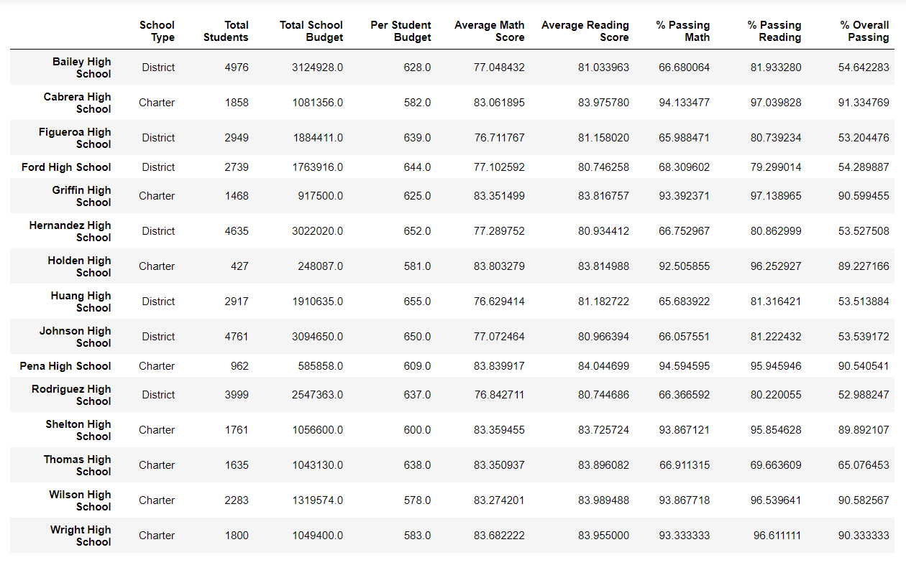
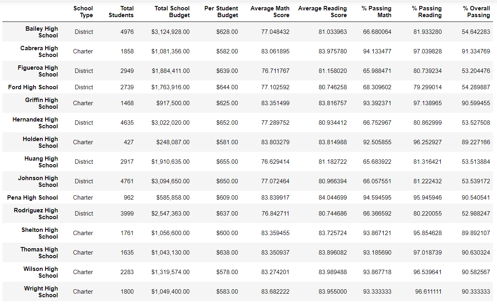
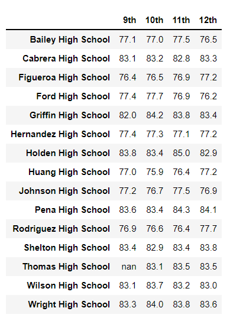
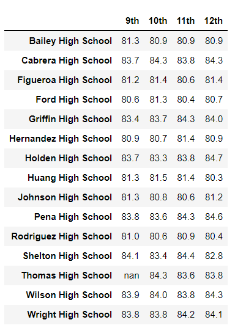

# School_District_Analysis

## Overview
This analysis has been conducted to see how different schools within a school district perform based on their students' results in standardized testing in Math and Reading. The results have been gathered using the marks in standardized testing. 

The schools have then been compared based on capita per student (spending per student), school size (small, medium, large) and the type of school (Charter or District). 

Due to potential dishonesty during the standardized testing at *Thomas High School*, the analysis had to be performed a second time around, at which point the test results for grade 9 students at *Thomas High School* have been omitted to create more accurate results.  

## Results

### How is the district summary affected?
Due to potential dishonesty during the standardized testing at *Thomas High School*, the analysis was conducted twice. The second time, the data for all grade 9 students at *Thomas High School* was replaced by **NaN** and omitted from the calculations of the analysis. 

The district results have changed due to omitting the data values. See below the results prior to removing the data for grade 9 students at *Thomas High School*:

The district results vary after the grade 9 data has been removed. Please see below:

### How does replacing the ninth graders’ math and reading scores affect Thomas High School’s performance relative to the other schools?

School Summary prior to NaN Replacement

School Summary after NaN Replacement

By replacing the ninth graders' math and reading scores with NaN, the overall passing percentage for Thomas High School increased to 90.63% making Thomas High School one of the Top 5 high schools in the district. 

### Replacing the ninth-grade scores affected the following:
#### Math and reading scores by grade
Math grades are as follows:

Reading grades are as follows:

## Summary

It is not possible to distinguish which student out of the grade 9 data set for *Thomas High School* committed the dishonesty. It was therefore necessary to remove the entire data for all grade 9s. This however make the data set not as accurate as now all grade 9 students' results from *Thomas High School* have been removed.

By replacing the ninth graders' scores with NaN, Thomas High School's was able to regain the second highest place for all high schools in the district. 
